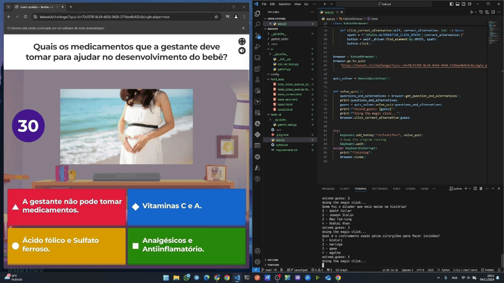
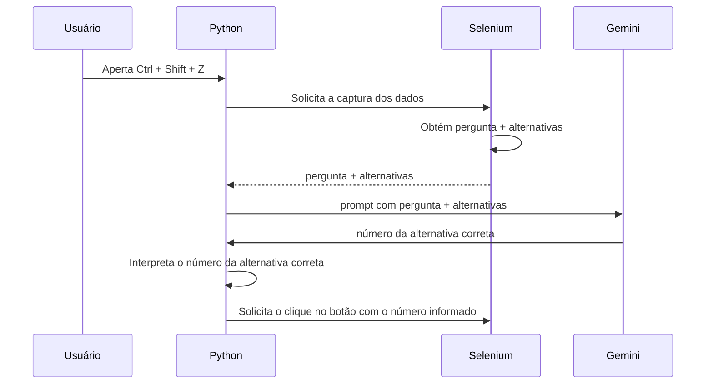

# Kahoot God - Revisited

Este projeto é uma releitura inspirada no vídeo ["Using AI to NEVER LOSE in KAHOOT"](https://www.youtube.com/watch?v=G0i_xx-6G-4) do canal: [The Coding Sloth](https://www.youtube.com/@TheCodingSloth) no YouTube.

**Veja o [vídeo no YouTube](https://youtu.be/4dv441aMSUw) de sobre como esse projeto foi feito!**

_Demonstração do código em funcionamento_:



Essa versão traz algumas melhorias e adaptações:

- **Uso do Selenium**: Em vez do [PyAutoGUI](https://pyautogui.readthedocs.io/en/latest/) + [Tesseract](https://pypi.org/project/pytesseract/) para obter questões e alternativas, o Selenium foi utilizado. Isso democratiza o acesso ao código, permitindo que funcione em qualquer resolução de tela, diferentemente da versão original que era limitada a telas 1440p.

- **Gemini**: Substituída a API paga do ChatGPT pela API gratuita do Gemini. Você pode obter uma chave seguindo este [passo-a-passo](https://ai.google.dev/gemini-api/docs/api-key?hl=pt-br).

- **Automação com Selenium**: Para selecionar a alternativa correta, o Selenium foi utilizado em vez do [PyAutoGUI](https://pyautogui.readthedocs.io/en/latest/), proporcionando maior precisão e mais agilidade.

**Nota**: Devido ao uso do Selenium, este código **não pode ser executado em servidores sem interface gráfica**. Outro ponto importante, para manter a simplicidade, você deve ter o [Chrome](https://support.google.com/chrome/answer/95346?hl=en&co=GENIE.Platform%3DDesktop) instalado.

## Como funciona

O funcionamento principal do programa é ilustrado conforme o digrama abaixo:



## Instalando Dependências com pip e requirements.txt

Para instalar todas as dependências listadas no arquivo `requirements.txt` de uma só vez, você pode usar o comando: `python -m pip install -r requirements.txt`. Este é um método bem eficiente e simples para configurar ambientes de desenvolvimento Python.

1. Certifique-se de que você está no diretório do projeto onde o arquivo `requirements.txt` está localizado.
1. Crie um ambiente virtual (pasta `.venv`) com o seguinte comando no terminal:
    ```shell
    python -m venv .venv
    ```
1. Ative seu ambiente virtual (se estiver usando um):
    - Windows
        ```shell
        .\.venv\Scripts\activate.ps1
        ```
    - Ubuntu
        ```shell
        source .venv/bin/activate
        ```
1. Execute o seguinte comando no terminal:
    ```
    python -m pip install -r requirements.txt
    ```
1. O pip lerá o arquivo `requirements.txt` e instalará todas as dependências listadas nele.


## Variáveis de Ambiente

As variáveis de ambiente podem ser configuradas via arquivo `.env` ou diretamente no sistema operacional.

| Nome da Variável | Descrição | Obrigatoriedade |
|------------------|-----------|-----------------|
| GEMINI_API_KEY   | Chave de API do Gemini | Obrigatório |
| GEMINI_MODEL     | Modelo utilizado no Gemini | Opcional (Valor padrão: `gemini-1.5-flash`) | 

Exemplo de um arquivo `.env`:

```shell
GEMINI_API_KEY=sua_chave_de_api_do_gemini
GEMINI_MODEL=gemini-1.5-flash
```

**Nota**: A lista de modelos do Gemini podem ser obtidas através dessa [URL](https://ai.google.dev/gemini-api/docs/models/gemini?hl=pt-br#model-variations).

## Opções de Execução

O programa aceita 0 ou 1 argumento, sendo este a URL opcional do Quiz do Kahoot.

### Com URL fornecida:

```shell
python app.py https://kahoot.it/challenge/?quiz-id=70cf378f-8c24-4d5d-9426-5718ae4b432c&single-player=true
```

**Nota**: Essa url foi a mesma utilizada no vídeo.

### Sem URL fornecida:

```shell
python app.py
```

Neste caso, um prompt solicitará a URL:

```shell
Enter the quiz URL:
```

## Instruções de Uso

1. Quando a questão aparecer no Kahoot com todas as alternativas na tela, pressione `Ctrl + Shift + Z` com o foco no terminal.

2. Para sair do programa, pressione `Ctrl + C` ou `Ctrl + V`.
